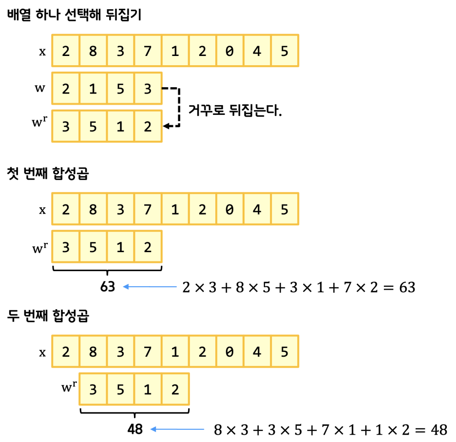

# CNN
### 2021-06-24
#machine_learning #cnn

 
한국어로 합성곱이라고 한다.

이미지 등에서 필터를 그동안은 사람이 만들었었는데,
이제는 학습을 통해서 계산하도록 하는 것이다.

예를 들어 옷을 구분한다면 옷의 윤곽이나 모양이 중요한데,
그외의 불필요한 정보를 없애는 필터를 얻는 것이다.

직관적으로 생각할 때,
신경망은 일렬로된 많은 변수(w1,w2,w2,…)들을 레이어를 거치면서 출력시키는건데,
2차원 이미지를 일렬로 배치하면 주변 픽셀과의 연관관계가 다 깨지기 때문에 학습을 하기가 어렵다.
그래서 합성곱을 시키는 과정이 필요한 것이다.

대표사진 삭제
사진 설명을 입력하세요.
합성곱을 구하기 위해서는 원본 x가 있을 때,
필터가 될 w 배열을 뒤집은 뒤 슬라이드하면서 내적을 구해나간다.
import numpy as np
x = np.array([2, 8, 3, 7, 1, 2, 0, 4, 5])
w = np.array([2, 1, 5, 3])

w_r = np.flip(w)
print(w_r)

for i in range(6):
    print(np.dot(x[i:i+4], w_r.reshape(-1,1)))

numpy로 구현한 코드는 위와 같고, scipy(과학용)에서 제공하는 convolve 함수를 통해 한번에 구할수도 있다.
from scipy.signal import convolve
convolve(x, w, mode=‘valid’)

근데 사실은 저 w를 계산해서 구할거기 때문에,
굳이 정의대로 뒤집에서 계산할 필요가 없다고 한다.

대표사진 삭제
사진 설명을 입력하세요.
뒤집지 않고 그대로 내적을 구하는 방식을 correlate라고 하며,
이 경우에도 그냥 관습적으로 합성곱 방식이라고 부르고 있다.

역시나 scipy에서 함수를 제공한다.
from scipy.signal import correlate
correlate(x, w, mode=‘valid’)

그런데 생각해보면, 양쪽 끝은 합성곱 계산에 참여한 빈도가 가운데보다 적게된다.
이를 방지하기 위해 양끝에 0으로된 패딩을 붙일 수 있는데,

대표사진 삭제
사진 설명을 입력하세요.
correlate(x, w, mode=‘full’)

mode를 full로 해서 설정할 수 있다.

대표사진 삭제
사진 설명을 입력하세요.
하지만 제로패딩의 경우 결과값이 많아져서 연산도 많이지기 때문에,
절충안으로 결과값이 원본과 같은 수가 나오도록 same padding을 이용할 수도 있다.
correlate(x, w, mode=‘same’)

그리고 필요에 따라 미끄러지는 정도도 정할 수 있는데,

대표사진 삭제
사진 설명을 입력하세요.
이 경우 연산량은 줄어들지만, 각 원소의 합성곱 참여빈도가 줄어든다.
또한 스트라이드는 전체 길이에 나눠떨어져야 한다.
(안그러면 오버플로우가 나서 쓰레기값이 연산에 쓰일 수 있다)

이제 2차원으로 넘어가보자.

대표사진 삭제
사진 설명을 입력하세요.
크게 다르지 않다. 마치 모습은 알고리즘 hash 문제를 풀때의 모습같다.
x = np.array([[1, 2, 3],
              [4, 5, 6],
              [7, 8, 9]])
w = np.array([[2, 0], [0, 0]])
from scipy.signal import correlate2d
correlate2d(x, w, mode=‘valid’)

결과의 크기 = ( 원본의 크기 - 필터의 크기 ) / 스트라이드 + 1

이제 한단계 더 가서 3차원이다.
3차원까지 온 이유는 실제 이미지는 가로 * 세로 * RGB channel의 3차원의 형태이기 때문이다.
(흑백 사진이 아니라 컬러 사진에서 구분을 할거니까)

대표사진 삭제
사진 설명을 입력하세요.
3차원이니 역시 행렬을 사용해서 계산하면 되고 형태는 위 수식처럼 익숙한 형태이다.
우리가 구하는 weight는 필터인 것이다.

대표사진 삭제
사진 설명을 입력하세요.
필터 또한 똑같은 3차원이기 때문에(같은 RGB channel), 합성곱의 결과물인 Feature Map(특성맵)은 채널크기가 1이 된다. 생각해보면 알 수 있다.

따라서 결론적으로 필터의 수만큼 feature Map이 나오게 된다.

대표사진 삭제
사진 설명을 입력하세요.

Keras에서는 합성곱 계산을 위해 tf.keras.layers.Conv2D라는 함수를 제공하고 4차원 배열을 인자로 받는데, 원본 이미지의 개수까지 배열에 한번에 넣어서 계산하기 때문이다.

이제 4차원까지 오게되니 머리속으로 그리기가 어렵운데, 이럴때 np.swapaxes()라는 함수를 잘 활용해야 한다. 이름에서 유추할 수 있듯, 축을 바꾸는 함수이다.
image = tf.constant(  [[ 
                         [[1,0,1],[1,1,1],[1,1,1],[0,0,1],[0,1,0]], 
                         [[0,0,1],[1,1,1],[1,1,1],[1,1,1],[0,0,0]], 
                         [[0,0,0],[0,0,0],[1,1,0],[1,1,1],[1,0,1]], 
                         [[0,0,0],[0,0,1],[1,1,1],[1,1,1],[0,1,0]], 
                         [[0,1,0],[1,1,1],[1,1,1],[0,0,0],[0,0,0]] 
                      ]],     dtype=np.float32)

maps = np.swapaxes(image, 0, 3)
for i, map in enumerate(maps):
    print(map.reshape(5,5))

원본 이미지의 shape은 (1,3,3,3)이다.
**(원본이미지 개수, 가로, 세로, 채널의 수)**인 것이다.

채널별로 필터를 뽑아내기 위해서는 for문을 3번 돌아야할 것 같은데,
그러기 위해서 첫 행의 요소를 for에 돌릴 녀석으로 바꿔주는 것이다.

그러기 위해서 swapaxes(image, 0, 3)를 돌려주면 0번 3번 축이 바뀌게 되어 shape이 (3,3,3,1)이 된다. 그것을 reshape하여 R,G,B 채널 3개의 결과를 얻게 된다.

그리고 **필터의 경우에는 (채널의 수, 가로, 세로, 필터의 수)**
이렇게 4차원의 데이터를 활용한다.
import tensorflow as tf
import numpy as np
import keras
from keras.layers import *
import matplotlib.pyplot as plt
image = tf.constant(  [[ 
                         [[1,0,1],[1,1,1],[1,1,1],[0,0,1],[0,1,0]], 
                         [[0,0,1],[1,1,1],[1,1,1],[1,1,1],[0,0,0]], 
                         [[0,0,0],[0,0,0],[1,1,0],[1,1,1],[1,0,1]], 
                         [[0,0,0],[0,0,1],[1,1,1],[1,1,1],[0,1,0]], 
                         [[0,1,0],[1,1,1],[1,1,1],[0,0,0],[0,0,0]] 
                      ]],     dtype=np.float32)

print(image.shape)
weight = np.array( [ 
                     [[[1,1],[0,1],[-1,-1]], [[0,0],[-1,0],[0,0]], [[1,1],[0,1],[0,0]]],
                     [[[0,0],[-1,0],[0,0]], [[1,1],[1,1],[1,1]], [[0,0],[-1,0],[0,0]]],
                     [[[1,1],[1,1],[0,0]], [[0,0],[-1,0],[0,0]], [[1,1],[0,1],[-1,-1]]]
                   ] )

print(“weight.shape”, weight.shape)
weight_init = tf.constant_initializer(weight)
conv2d = tf.keras.layers.Conv2D(filters=2, kernel_size=3, padding=‘valid’, kernel_initializer=weight_init)(image)
print(“conv2d.shape”, conv2d.shape)
feature_maps = np.swapaxes(conv2d, 0, 3)
for feature_map in feature_maps:
    print(feature_map.reshape(3,3))

최종적인 Keras를 활용한 합성곱의 코드는 위와 같다.

대표사진 삭제
사진 설명을 입력하세요.
합성곱을 통해서 특성을 뽑아내면 크기는 줄고 두께는 두꺼워진다. (배운대로 채널의 개수만큼)
그것의 크기를 또 줄인것이 풀링층이고, 이렇게 크기를 줄여놔야 신경망에 태울 수가 있게 된다.

대표사진 삭제
사진 설명을 입력하세요.
이렇게 Feature Map을 순회하며 최대값이나 평균값 등을 뽑아내는 것을 Pooling이라고 한다.
최대값을 뽑는 경우 Max Pooling이라고 부르는데, 가장 특징적인 값이 남게된다.
(예를 들면 고양이의 귀나 눈의 모양이라던지)

코드는 아래와 같고,
image = tf.constant([[[[4],[3]],[[2],[1]]]], dtype=np.float32)
pool = tf.keras.layers.MaxPool2D(pool_size=(2,2), strides=1, padding=‘valid’)(image)

그림으로 살펴보면,

대표사진 삭제
사진 설명을 입력하세요.
필터 5개에 의해 이런 특성맵이 뽑혀나올때 Max pooling을 진행하면,

대표사진 삭제
사진 설명을 입력하세요.
이런식으로 중요하다고 생각되는 값들만 점점 남게되고, 이제 신경망에 쓸 준비가 되었다.

그전에 마지막으로 활성함수(Activation function)에 대한 정리가 다시 필요하다.
활성함수는 네트워크에 비선형성(nonlinearity)을 추가하기 위해 사용하는데, 활성함수가 없이는 레이어를 추가해도 하나의 레이어와 차이가 없으므로 레이어와 레이어 사이에는 필수적으로 필요하다.

대표사진 삭제
사진 설명을 입력하세요.
기존에 사용하던 시그모이드 함수는 미분값 분포를 살펴보면 양 꼬리쪽이 0에 가까워,
점점 역전파시 학습이 전달되지 않는 문제가 있다.
(Gradient vanishing 문제)

대표사진 삭제
사진 설명을 입력하세요.
그래서 하이퍼 볼릭 탄젠트라는 다른 함수도 제안되었지만,
역시나 Gradient vanishing 문제가 있다.

그래서 한번쯤 들어봄직한 Relu(Rectified Linear Unit)가 쓰이게 되었다.
Relu는 음수 부분을 0으로 만들어주는 비선형 함수이다.

대표사진 삭제
사진 설명을 입력하세요.

대표사진 삭제
사진 설명을 입력하세요.
수식도 시그모이드에 비해 아주 간단해서 속도가 6배 이상 빠르다.
역시나 0으로 바뀐 음수영역에서는 학습이 되질 않고, 중심값이 0이 아닌 단점이 있지만,
전반적으로 더 훌륭한 성능을 보인다.

대표사진 삭제
사진 설명을 입력하세요.
그래서 합성곱층에서 풀링층(레이어간) 사이에 활성화 함수를 쓰는 것이고,
최종 특성맵을 펼쳐서(flatten) Fully connected layer를 사용한다.

Tensorflow를 이용한 구현은 아래와 같다.
import tensorflow as tf

class ConvolutionNetwork:
    
    def __init__(self, n_kernels=10, units=10, batch_size=32, learning_rate=0.1):
        self.n_kernels = n_kernels  # 합성곱의 커널 개수
        self.kernel_size = 3        # 커널 크기(Filter의 수)
        self.optimizer = None       # 옵티마이저
        self.conv_w = None          # 합성곱 층의 가중치
        self.conv_b = None          # 합성곱 층의 절편
        self.units = units          # 은닉층의 뉴런 개수
        self.batch_size = batch_size  # 배치 크기
        self.w1 = None              # 은닉층의 가중치
        self.b1 = None              # 은닉층의 절편
        self.w2 = None              # 출력층의 가중치
        self.b2 = None              # 출력층의 절편
        self.a1 = None              # 은닉층의 활성화 출력
        self.losses = []            # 훈련 손실
        self.val_losses = []        # 검증 손실
        self.lr = learning_rate     # 학습률

    def forpass(self, x):
        # 3x3 합성곱 연산을 수행합니다.
        c_out = tf.nn.conv2d(x, self.conv_w, strides=1, padding=‘SAME’) + self.conv_b

        # 렐루 활성화 함수를 적용합니다.
        r_out = tf.nn.relu(c_out)

        # 2x2 최대 풀링을 적용합니다.
        p_out = tf.nn.max_pool2d(r_out, ksize=2, strides=2, padding=‘VALID’)
        # 첫 번째 배치 차원을 제외하고 출력을 일렬로 펼칩니다.

        f_out = tf.reshape(p_out, [x.shape[0], -1])

        z1 = tf.matmul(f_out, self.w1) + self.b1     # 첫 번째 층의 선형 식을 계산합니다
        a1 = tf.nn.relu(z1)                          # 활성화 함수를 적용합니다
        z2 = tf.matmul(a1, self.w2) + self.b2        # 두 번째 층의 선형 식을 계산합니다.
        return z2
    
    def init_weights(self, input_shape, n_classes):
        g = tf.initializers.glorot_uniform()
        self.conv_w = tf.Variable(g((3, 3, 1, self.n_kernels)))
        self.conv_b = tf.Variable(np.zeros(self.n_kernels), dtype=float)
        n_features = 14 * 14 * self.n_kernels
        self.w1 = tf.Variable(g((n_features, self.units)))          # (특성 개수, 은닉층의 크기)
        self.b1 = tf.Variable(np.zeros(self.units), dtype=float)    # 은닉층의 크기
        self.w2 = tf.Variable(g((self.units, n_classes)))           # (은닉층의 크기, 클래스 개수)
        self.b2 = tf.Variable(np.zeros(n_classes), dtype=float)     # 클래스 개수
        
    def fit(self, x, y, epochs=100, x_val=None, y_val=None):
        self.init_weights(x.shape, y.shape[1])    # 은닉층과 출력층의 가중치를 초기화합니다.
        self.optimizer = tf.optimizers.SGD(learning_rate=self.lr)
        # epochs만큼 반복합니다.
        for i in range(epochs):
            print(‘에포크’, i, end=‘ ‘)
            # 제너레이터 함수에서 반환한 미니배치를 순환합니다.
            batch_losses = []
            for x_batch, y_batch in self.gen_batch(x, y):
                print(‘.’, end=‘’)
                self.training(x_batch, y_batch)
                # 배치 손실을 기록합니다.
                batch_losses.append(self.get_loss(x_batch, y_batch))
 
            print()
            # 배치 손실 평균내어 훈련 손실 값으로 저장합니다.
            self.losses.append(np.mean(batch_losses))
            # 검증 세트에 대한 손실을 계산합니다.
            self.val_losses.append(self.get_loss(x_val, y_val))

    # 미니배치 제너레이터 함수
    def gen_batch(self, x, y):
        bins = len(x) // self.batch_size                   # 미니배치 횟수
        indexes = np.random.permutation(np.arange(len(x))) # 인덱스를 섞습니다.
        x = x[indexes]
        y = y[indexes]
        for i in range(bins):
            start = self.batch_size * i
            end = self.batch_size * (i + 1)
            yield x[start:end], y[start:end]   # batch_size만큼 슬라이싱하여 반환합니다.
            
    def training(self, x, y):
        m = len(x)                    # 샘플 개수를 저장합니다.
        with tf.GradientTape() as tape:
            z = self.forpass(x)       # 정방향 계산을 수행합니다.
            # 손실을 계산합니다.
            loss = tf.nn.softmax_cross_entropy_with_logits(y, z)
            loss = tf.reduce_mean(loss)

        weights_list = [self.conv_w, self.conv_b,
                        self.w1, self.b1, self.w2, self.b2]
        # 가중치에 대한 그래디언트를 계산합니다.
        grads = tape.gradient(loss, weights_list)
        # 가중치를 업데이트합니다.
        self.optimizer.apply_gradients(zip(grads, weights_list))
   
    def predict(self, x):
        z = self.forpass(x)                 # 정방향 계산을 수행합니다.
        return np.argmax(z.numpy(), axis=1) # 가장 큰 값의 인덱스를 반환합니다.
    
    def score(self, x, y):
        # 예측과 타깃 열 벡터를 비교하여 True의 비율을 반환합니다.
        return np.mean(self.predict(x) == np.argmax(y, axis=1))

    def get_loss(self, x, y):
        z = self.forpass(x)                 # 정방향 계산을 수행합니다.
        # 손실을 계산하여 저장합니다.
        loss = tf.reduce_mean(tf.nn.softmax_cross_entropy_with_logits(y, z))
        return loss.numpy()

# CNN 클래스 사용
cn = ConvolutionNetwork(n_kernels=10, units=100, batch_size=128, learning_rate=0.01)
cn.fit(x_train, y_train_encoded, 
       x_val=x_val, y_val=y_val_encoded, epochs=20)

코드를 자세히 살펴보면,
    def forpass(self, x):
        # 3x3 합성곱 연산을 수행합니다.
        c_out = tf.nn.conv2d(x, self.conv_w, strides=1, padding=‘SAME’) + self.conv_b

self.conv_w, self.conv_b는 합성곱에 사용할 필터에 대한 weight와 bias이다.

        r_out = tf.nn.relu(c_out)
        p_out = tf.nn.max_pool2d(r_out, ksize=2, strides=2, padding=‘VALID’)

        # Flatten
        f_out = tf.reshape(p_out, [x.shape[0], -1])

활성화함수(Relu)와 Max pooling는 텐서플로우를 통해 쉽게 진행할 수 있다.
마지막에 flatten을 통해 일렬로 데이터를 배치한 뒤, 신경망에 태운다.
        z1 = tf.matmul(f_out, self.w1) + self.b1     # 첫 번째 층의 선형 식을 계산합니다
        a1 = tf.nn.relu(z1)                          # 활성화 함수를 적용합니다
        z2 = tf.matmul(a1, self.w2) + self.b2        # 두 번째 층의 선형 식을 계산합니다.

신경망은 앞서 계속 공부해왔듯 위의 코드와 같다.
굉장히 복잡해졌지만 결국 코드는 행렬곱을 통해 Linear regression때와 크게 다르지 않다.

항상 그렇듯 어려운 것은 역전파인데, 미분을 직접해서 수식을 구현하지말고 이제 텐서플로우의 자동미분을 활용해보자. 그전에 먼저 python 문법을 하나 익히고 가야하는데 with 구문이다.
class Connector:
    def __enter__(self):
        print(‘DB 연결함’)
        
    def __exit__(self, type, value, tb):
        print(‘DB 연결 끊음’)

with  Connector()   as   db:
    print(‘DB 작업중…’)

위 코드를 보면 대충 알겠지만 Connector() 객체에 대해 __enter__, __exit__를 자동으로 호출해주는 구문이다.

x = tf.Variable(np.array([1.0, 2.0, 3.0]))
with tf.GradientTape() as tape:
    y = x ** 3 + 2 * x + 5
# 그래디언트를 계산합니댜.
print(tape.gradient(y, x))

텐서플로우에서 구현한 GradientTape과 with 구문을 활용하면,
정방향 계산과정을 tape에 기록해뒀다가 tape.gradient() 함수를 통해 자동으로 미분을 제공해준다.

이를 이용해서 위 신경망의 미분과정을 구현해보면, 우선 tape에 손실을 구할때까지의 과정을 기록하는데,
def training(self, x, y):
    m = len(x)
    # 샘플 개수를 저장합니다.
    with tf.GradientTape() as tape:
        z = self.forpass(x) # 정방향 계산을 수행합니다.

        # 손실을 계산합니다.
        loss = tf.nn.softmax_cross_entropy_with_logits(y, z)
        loss = tf.reduce_mean(loss)

정방향 forpass() 계산과정에 대해 기록한 뒤에, y(정답)에 대한 z(계산값)에 대한 손실함수(cross entropy) 및 클래스화시켜주는 softmax를 진행한 뒤, 손실 평균을 내서 최종 loss값을 계산할 수 있다.

그 뒤 자동미분을 활용하는데,
 def training(self, x, y):
        …
        weights_list = [self.conv_w, self.conv_b,
                        self.w1, self.b1, self.w2, self.b2]

        # 가중치에 대한 그래디언트를 계산합니다.
        grads = tape.gradient(loss, weights_list)
        # 가중치를 업데이트합니다.
        self.optimizer.apply_gradients(zip(grads, weights_list))

미분을 계산할 모든 파라메터를 리스트로 담은 뒤, 한방에 계산을 할 수 있다.
이 과정에서 optimizer를 사용하는데, optimizer는 fit() 함수에서 지정을 한다.
def init_weights(self, input_shape, n_classes):
    g = tf.initializers.glorot_uniform()
    self.conv_w = tf.Variable(g((3, 3, 1, self.n_kernels)))

초기값을 설정하는 것이 최적화에 굉장히 중요한 요소인데,
전에는 0 대신 랜덤값을 활용해서 결과를 더 좋게 만들었었다.

텐서플로우에서 제공하는 방식인 glorot_uniform을 이번에는 활용해 초기 가중치 및 바이어스의 초기값을 지정하였다. (glorot은 고안한 사람이름이다)

대표사진 삭제
사진 설명을 입력하세요.

대표사진 삭제
사진 설명을 입력하세요.
위 범위내에서 랜덤값을 초기값으로 지정하면 성과가 좋다고 한다.

대표사진 삭제
사진 설명을 입력하세요.
이렇게 최종적으로 코드를 돌려보면 아주 잘 작동하는 것을 알 수 있다.

Keras를 사용하면 코드가 훨씬 짧아진다.
훨씬 추상화되어있고 지금까지 공부한 내용이 함수로 쉽게 구현되어 한줄 한줄 의미를 알 수 있다.
from tensorflow.keras.layers import Conv2D, MaxPooling2D, Flatten, Dense

conv1 = tf.keras.Sequential()
conv1.add(Conv2D(10, (3, 3), activation=‘relu’, padding=‘same’, input_shape=(28, 28, 1)))
conv1.add(MaxPooling2D((2, 2)))
conv1.add(Flatten())
conv1.add(Dense(100, activation=‘relu’))
conv1.add(Dense(10, activation=‘softmax’))

# 드랍아웃
conv2.add(Dropout(0.5))

conv1.summary()
conv1.compile(optimizer=‘adam’, loss=‘categorical_crossentropy’,
              metrics=[‘accuracy’])

history = conv1.fit(x_train, y_train_encoded, epochs=20, 
                    validation_data=(x_val, y_val_encoded))

optimizer로 adam(Adaptive Moment Estimation)을 사용하였는데, 성능이 더 뛰어나다고 한다.
(손실함수의 값이 최적값에 가까워질수록 학습률을 낮춰 손실 함수의 값이 안정적으로 수렴될 수 있게 한다)

대표사진 삭제
사진 설명을 입력하세요.
Dropout이라는 기법을 사용하면 더 최적화시킬 수 있다.
(overfitting을 방지하기 위해 훈련 시 사용하지 않을 노드 무작위 선정)

지금까지 한 내용을 정리해보면 어떤 사진들을 분류를 하고 싶을 때,
구분을 위한 특징을 잘 뽑아낼 수 있는 필터를 만들어내는 과정을 진행하였다.

그래서 임의의 값으로 필터를 만들어서 나온 값과 정답을 비교하여 계속 학습시켜서 잘 구분할 수 있는 필터를 만들어 내게되고 하나의 모델이 된다.

이제 앞으로 새로운 이미지를 활용하더라도, 이렇게 계산된 weight와 bias를 활용해서 입력을 넣으면 학습에 따른 정확도에 따라 결과가 나오게 될 것이다.
 
